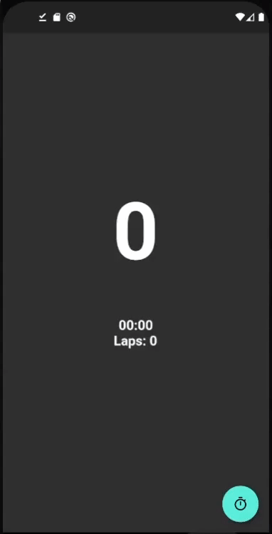

# Looped Timer

<<<<<<< HEAD
This is a timer app design for workouts. It loops over chosen number of seconds so the user can change the exercise every time it loops, providing equal intervals for every exercise.

=======
Flutter stopwatch/timer app that makes a sound every certain number of seconds. Usefull for sports excercises to have equal time to do each excercise.
>>>>>>> e33903650fa5637c5875c43be8af54887ed0ebf1
